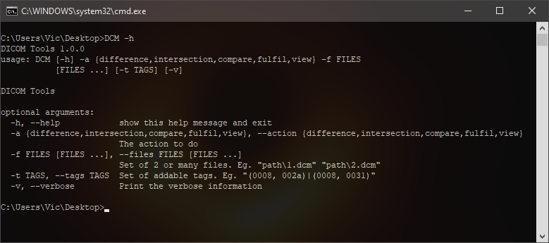

### DICOM Tools CLI ###
_ _ _

DICOM Tools - for testing and troubleshooting.

##### INSTALLATION #####

> The [PyVutils](https://github.com/vic4key/PyVutils) library can be found on GitHub
>
> Run `PyInstaller --onefile DCM.py` or `builder.cmd` to create a single exe

##### COMMANDS #####

> $ python3 DCM.py -h

##### SCREENSHOTS #####

_ _ _

Website: https://vic.onl/